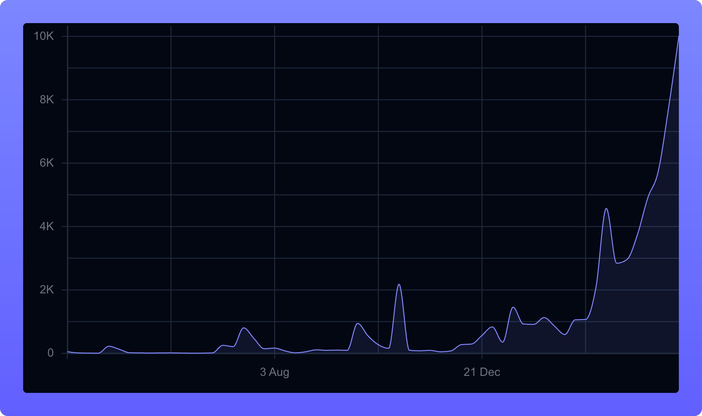

<p align="center">
  
</p>

<p align="center">
  <h3 align="center">The type-safe analytics backend for ClickHouse</h3>
</p>

<h4 align="center">Build ClickHouse queries once, run them inline, over HTTP, in React, or from agents.</h4>

<p align="center">
  <a href="https://github.com/hypequery/hypequery/blob/main/LICENSE">
    
  </a>
  <a href="https://www.npmjs.com/package/@hypequery/cli">
    
  </a>
  <a href="https://www.npmjs.com/package/@hypequery/clickhouse">
    
  </a>
  <a href="https://www.npmjs.com/package/@hypequery/serve">
    
  </a>
  <a href="https://www.npmjs.com/package/@hypequery/react">
    
  </a>
</p>

<p align="center">
  <a href="https://www.npmjs.com/package/@hypequery/clickhouse">
    
  </a>
</p>

<p align="center">
  <a href="https://hypequery.com/docs">Docs</a> •
  <a href="https://hypequery.featurebase.app/roadmap">Roadmap</a> •
  <a href="https://github.com/hypequery/hypequery-examples">Examples</a>
</p>

## The problem

Querying ClickHouse from TypeScript with the official client means writing raw SQL strings, casting results to `any`, and maintaining hand-rolled types that drift from your real schema:

```ts
// Raw @clickhouse/client — no types, no safety, breaks silently
const result = await client.query({
  query: `SELECT region, sum(total) as revenue
          FROM orders
          WHERE created_at >= '2026-01-01'
          GROUP BY region
          ORDER BY revenue DESC`,
  format: 'JSONEachRow',
});
const rows = await result.json(); // typed as any[]
//    ^^^^ schema drift, typos, and runtime errors are on you
```

## The solution

hypequery generates TypeScript types directly from your live ClickHouse schema, then gives you a fluent query builder where every table name, column, filter, and result is fully typed:

```ts
import { createQueryBuilder } from '@hypequery/clickhouse';
import type { IntrospectedSchema } from './analytics/schema.js';

const db = createQueryBuilder<IntrospectedSchema>({ /* connection */ });

const revenueByRegion = await db
  .table('orders')             // ✅ autocompletes your real tables
  .select(['region'])          // ✅ only valid columns for this table
  .where('created_at', 'gte', '2026-01-01') // ✅ type-checked operator + value
  .sum('total', 'revenue')     // ✅ typed aggregation
  .groupBy('region')
  .orderBy('revenue', 'DESC')
  .execute();
// revenueByRegion is fully typed — no casting, no surprises
```

If this saves you from hand-writing ClickHouse types, a ⭐ helps other TypeScript devs find it.

## Why hypequery

- Build on top of your real ClickHouse schema instead of hand-maintained query types
- Reuse the same query definition across scripts, APIs, React apps, and agents
- Start local with the query builder, then add HTTP routes only when you need them
- Keep inputs, outputs, and SQL behavior explicit enough to test and reason about

## Packages

- `@hypequery/clickhouse`: typed ClickHouse query builder
- `@hypequery/serve`: code-first runtime for query contracts, HTTP routes, docs, and adapters
- `@hypequery/react`: thin TanStack Query hooks for hypequery APIs
- `@hypequery/cli`: scaffolding, schema generation, and local dev tooling

## Quick Start

```bash
npm install -D @hypequery/cli
npx hypequery init
```

That gives you the main path:

1. Generate schema types from ClickHouse
2. Write typed queries locally
3. Expose the queries over HTTP when you need a shared contract

## Add Contracts And HTTP When Needed

```ts
import { initServe } from '@hypequery/serve';
import { z } from 'zod';
import { db } from './analytics/client.js';

const { query, serve } = initServe({
  context: () => ({ db }),
  basePath: '/api/analytics',
});

const activeUsers = query({
  description: 'List active users by region',
  input: z.object({ region: z.string() }),
  query: ({ ctx, input }) =>
    ctx.db
      .table('users')
      .where('status', 'eq', 'active')
      .where('region', 'eq', input.region)
      .execute(),
});

export const api = serve({
  queries: { activeUsers },
});

api.route('/activeUsers', api.queries.activeUsers);
```

The same query can then be:

- executed directly with `api.execute(...)`
- exposed as an HTTP route
- consumed from React with `@hypequery/react`
- described for tools and agents

## CLI

```bash
# Scaffold analytics files and env vars
npx hypequery init

# Run the local dev server with docs
npx hypequery dev

# Regenerate schema types
npx hypequery generate
```

## Learn More

- [Quick start](https://hypequery.com/docs/quick-start)
- [Core concepts](https://hypequery.com/docs/core-concepts)
- [Query building](https://hypequery.com/docs/query-building/basics)
- [CLI reference](https://hypequery.com/docs/reference/api/cli)

## License

Apache-2.0. See [LICENSE](LICENSE).
