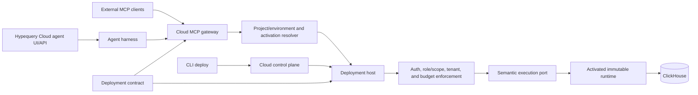

# MCP, Cloud, and Agent Data Platform Plan

**Status:** Working draft

**Updated:** 2026-08-31

**Scope:** `@hypequery/mcp`, `@hypequery/datasets`, deployment contracts/runtime, Hypequery Cloud hosted MCP, and the Cloud agent harness

## 1. Outcome

Hypequery should become the governed semantic firewall between AI agents and
ClickHouse:

> Define trusted datasets and metrics once, deploy them once, and make them
> safely usable from every MCP client and from Hypequery's own hosted agent.

The recommended product sequence is:

1. Make the existing MCP package bounded, contract-derived, and
   transport-neutral.
2. Add a first-class semantic execution path to the deployment data plane.
3. Ship hosted MCP in Cloud as an authenticated adapter over an activated
   deployment.
4. Build the Cloud agent harness as a client of that same hosted MCP surface.
5. Add evaluation, observability, and workflow loops that improve every
   deployed semantic model.

Hosted MCP should come before the hosted agent harness. It is the smaller and
more defensible Cloud primitive: customers can use their preferred model and
agent while Hypequery owns governance, execution, and operations. The hosted
agent then becomes a first-party experience built on the same primitive.

## 2. Current Assessment

### Overall assessment

`@hypequery/mcp` is strategically correct but is currently a local MCP adapter,
not yet a production agent-data platform.

| Area | Current state | Assessment |
| --- | --- | --- |
| Semantic safety | Dataset/metric allowlists, typed filters, parameterized SQL, and tenant scoping | Strong foundation |
| Agent usability | Discovery, schema introspection, metric queries, dataset queries, and a guide prompt | Useful first product |
| Input contracts | MCP schemas are generic and separately maintained from dataset-generated schemas | Material correctness gap |
| Resource control | Explicit limits are validated, but omitted limits can produce unbounded queries | Release blocker |
| Transport | Stdio only | Local development only |
| Cloud execution | Immutable deployment contracts and supervised runtimes exist | Strong foundation, missing semantic invocation bridge |
| Auth and tenancy | Local MCP has a fixed trusted tenant; deployment data plane has request principals and tenant resolution | Cloud building blocks exist |
| Results | JSON encoded into text content | Functional, not native structured MCP output |
| Quality and operations | Unit coverage exists; live, transport, load, timeout, and large-result coverage is incomplete | Not production-ready |

Working score: **6/10 today, with a credible path to 9/10** once the same
contract governs local MCP, hosted MCP, and the hosted agent.

### Current feature surface

The package exposes four tools and one prompt:

- `list_datasets`
- `get_dataset_schema`
- `query_metric`
- `query_dataset`
- `dataset_guide`

The local execution flow is:

```text
MCP client
  -> stdio transport
  -> MCP tool handler
  -> dataset registry
  -> DatasetClient
  -> semantic validation and tenant injection
  -> semantic planner/query builder
  -> ClickHouse
```

It inherits important behavior from `@hypequery/datasets`: field and operator
validation, derived metrics, measure filters, time grains, queryable one-hop
relationships, parameterized ClickHouse queries, fail-closed tenant scoping,
pagination, and semantic caching.

### How datasets work with MCP today

Datasets are registered as an object map. Named metrics are attached to each
dataset by spreading the dataset and adding a `metrics` object. MCP builds a
catalog from that registry for listing and introspection. Query tools resolve a
dataset or metric from the registry and execute it through `DatasetClient`.

This is a good runtime boundary: the model does not receive a raw SQL tool or a
database connection. It can only request semantic fields and operations already
published by the application.

The current dataset boundary is intentionally constrained:

- Measures execute on their owning dataset.
- `belongsTo` and `hasOne` relationships can expose queryable dimensions.
- `hasMany` remains metadata-only to avoid unsafe fan-out.
- Arbitrary cross-dataset measures and arbitrary SQL are not exposed.

Those constraints are product strengths for agent use and should not be
removed to match generic database MCP servers.

### Immediate correctness and maintenance gaps

The following should be fixed before adding a network transport:

1. `DEFAULT_QUERY_LIMIT` exists but is not applied. An omitted `limit` can
   execute an unbounded query, and dataset `maxResultSize` only constrains an
   explicit limit.
2. There is no complete query budget covering timeout/cancellation,
   concurrency, response bytes, maximum offset, or total dimensions, measures,
   and filters at the MCP boundary.
3. MCP tool schemas are hand-built in `packages/mcp-server/src/server.ts` even
   though `packages/datasets/src/tools.ts` already derives more precise schemas
   from the catalog.
4. The generic MCP schema does not express exact dataset/field enums, field-level
   filter operators, integer bounds, closed nested objects, or the requirement
   for at least one dimension or measure.
5. Query results are returned as serialized text rather than MCP
   `structuredContent` with a declared output schema.
6. Introspection exposes physical source, column, SQL, measure field, and tenant
   key details. These need an agent-safe view and an opt-in trusted debug view.
7. Dataset-level descriptions, examples, synonyms, formats/units, currency,
   timezone, freshness, ownership, sensitivity, and verified questions are
   missing or incomplete.
8. Publishing named metrics through `{ ...dataset, metrics: {...} }` is
   awkward and encourages registry shape drift.
9. The server reports `0.1.0` by default while the package is currently
   `0.5.5`.
10. `packages/mcp-server/examples/mcp-config.js` defines `revenue` but creates
    `totalRevenue` from the nonexistent `totalRevenue` measure.
11. The `system.numbers` example is an especially dangerous demonstration of
    the omitted-limit behavior because the source is infinite.
12. Test documentation and counts have drifted from the implementation, and
    the current integration coverage does not adequately prove real transport,
    ClickHouse, cancellation, or response-budget behavior.

## 3. How This Fits Hypequery Cloud

### What Cloud already provides

The Cloud/deployment work is not a parallel architecture. It already contains
most of the control and execution primitives hosted MCP needs:

- An immutable `ProtocolDeploymentContract` containing datasets, metrics,
  relationships, limits, endpoint access policies, tenant policies, and runtime
  artifact identities.
- Authenticated bundle intake, validation, content identities, durable storage,
  activation revisions, rollback, and target selection by project/environment.
- Readiness-gated runtime materialization and supervision.
- A deployment host that binds the active immutable generation to a data plane.
- A data plane with authentication, roles/scopes, tenant resolution, input and
  output validation, `AbortSignal` propagation, and stable error categories.
- Node and Fetch adapters suitable for provider-specific Cloud infrastructure.

This means the activated deployment contract should be the source of truth for
hosted MCP. Cloud should not ask users to upload or maintain a second MCP config.

### The missing bridge

The current deployment contract contains dataset and metric metadata, but
`createDeploymentDataPlane()` builds executable routes only from
`deployment.queries`. Dataset and metric endpoint policies are present in the
contract but are not yet executable through `DeploymentHost`.

That is the central integration gap.

The solution is a first-class semantic execution port in the deployment layer,
not a Cloud-only reimplementation of `DatasetClient` and not a catch-all raw SQL
route.

A conceptual request is:

```ts
type DeploymentSemanticInvocation = {
  target: { project: string; environment: string };
  activationRevision?: string;
  operation:
    | { kind: 'dataset'; dataset: string; query: ProtocolDatasetQuery }
    | { kind: 'metric'; dataset: string; metric: string; query: ProtocolMetricQuery };
  credentials?: unknown;
  signal?: AbortSignal;
};
```

The public shape does not need to match this sketch exactly. The invariant is
that it must reuse the deployment generation, policy enforcement, tenant
resolution, validation budgets, cancellation, and error model already used by
the named-query data plane.

### Target architecture



For latency, the agent harness may use an in-process or internal-network MCP
client. It must still pass through the same logical gateway/tool executor and
policy checks. It must not call ClickHouse or `DatasetClient` through a private
superuser path.

### Ownership boundaries

| Layer | Owns | Must not own |
| --- | --- | --- |
| `@hypequery/datasets` | Semantic definitions, catalog, exact tool schemas, query validation/planning, result contracts | Network auth, Cloud routing, model loops |
| `@hypequery/mcp` | Transport-neutral MCP tool/resource/prompt adapter, MCP result/error mapping, stdio adapter | Tenant selection, Cloud secrets, duplicated semantic schemas |
| `@hypequery/protocol` | Immutable portable dataset/metric/deployment contracts and validators | Provider-specific transport or storage |
| `@hypequery/deployment` | Activated generation, semantic and named-query execution ports, policy context, cancellation, stable errors | OAuth UI, billing, model orchestration |
| Cloud MCP gateway | Streamable HTTP, OAuth/token verification, project/environment resolution, discovery, quotas, tracing, deployment revision pinning | Semantic reimplementation, database credentials in model context |
| Cloud agent harness | Model/tool loop, sessions, streaming, model usage, response rendering, retries, evaluation hooks | Data authorization, tenant arguments, direct SQL/database execution |
| Cloud control plane | Deployments, activation, secrets, plans, quotas, audit, retention, metering | A second semantic definition format |

### Contract and activation behavior

The MCP tool catalog must be derived from the active deployment contract and
cached by immutable deployment identity. A client must not list tools from one
generation and silently execute them against another.

For the first hosted release:

- Resolve project/environment from the endpoint and authenticated principal.
- Reconcile and read the active deployment generation.
- Generate the agent-safe catalog and tool schemas from that generation.
- Pin tool calls to its `activationRevision`.
- If activation changes, either notify a capable MCP client that the tool list
  changed or return a typed stale-contract response that causes relisting.
- Include deployment/release identity in internal traces and non-sensitive MCP
  result metadata.

No database secret, tenant key value, or unrestricted deployment source should
enter a prompt or tool description.

## 4. Product Shape

### Local MCP

Local MCP remains the fastest developer loop:

```bash
hypequery mcp analytics/api.ts
```

It loads the same Serve/dataset configuration as `hypequery dev`, applies local
credentials and an explicitly trusted tenant context, and uses stdio. It should
share all catalog generation, validation, budget, result, and error code with
hosted MCP.

### Hosted MCP

Deploying to Cloud should automatically create an authenticated MCP endpoint for
that project/environment, for example:

```text
https://mcp.hypequery.com/{project}/{environment}
```

The final URL shape is a Cloud routing decision. The user experience should be:

1. Define datasets/metrics.
2. Run `hypequery deploy`.
3. Copy a generated MCP client configuration or connect with OAuth.
4. Ask governed questions without running a local process.

The hosted beta should support API tokens/JWTs for automation and OAuth for
interactive MCP clients. Tenant context is resolved from the authenticated
principal or a server-side mapping. It is never a model-controlled tool
argument.

### Tool shape

Use the existing dataset tool generator as the canonical source and support
three modes:

- `catalog`: stable discovery plus `query_dataset`/`query_metric`; best for
  large catalogs.
- `per-dataset`: one exact query tool per published dataset; better argument
  accuracy for moderate catalogs.
- `per-metric`: one exact tool per verified metric; highest accuracy for curated
  business questions.

The recommended hosted default is a hybrid:

- Always provide safe catalog discovery and schema resources.
- Publish per-metric tools for verified metrics.
- Publish per-dataset tools while the authorized catalog remains under a
  configured tool-count/description-byte budget.
- Fall back to catalog query tools for large catalogs.

Tool listing should be authorization-aware so inaccessible datasets and metrics
are not advertised. Authorization must still be checked again on every call.

### Hosted agent harness

The first-party agent is a separate orchestration layer that consumes hosted
MCP. It owns:

- Conversation and run state.
- Model/provider selection and streaming.
- The plan/tool/result loop and retry policy.
- Token, model, and agent-run cost accounting.
- Result presentation, tables, charts, and downloadable artifacts.
- Feedback capture and evaluation replay.

Every agent run should record:

- User/service principal and resolved tenant reference.
- Project, environment, activation revision, release identity, and bundle
  identity.
- Model and prompt version.
- Tool catalog version and ordered tool calls.
- Query duration, rows, response bytes, cache outcome, errors, and cancellation.
- Token usage and model cost.
- User feedback, without retaining sensitive results beyond configured policy.

The harness should use a delegated user token or a narrowly scoped service token
bound to the user's authorization. A global internal superuser token would
invalidate the security model.

## 5. PR-by-PR Execution Plan

Durations are directional and assume Core and Cloud can work in parallel after
the shared interfaces in Milestone 0 are agreed.

The plan contains 31 active delivery PRs and two explicitly deferred
relationship PRs. The count reflects the full local, hosted, agent, and GA
horizon; the hosted MCP private-beta critical path does not require the agent or
GA PRs.

### PR rules

- Each PR belongs to one repository and one primary concern. A coordinated Core
  and Cloud change is represented as two PRs with an explicit dependency.
- Each PR must be independently mergeable. Consumers may remain behind a
  disabled route or test adapter until the next PR, but the default branch must
  stay releasable.
- Public exports remain backward compatible unless the PR includes the agreed
  protocol version/migration path.
- Every PR includes its unit or contract tests. Live, load, and compatibility
  suites are added in dedicated PRs so functional changes do not hide test
  infrastructure changes.
- PR descriptions should copy the corresponding row below, link its dependency,
  and state the milestone exit criteria it advances.
- A PR does not absorb a later row merely because adjacent code is convenient
  to touch.

### Dependency overview

```text
Safety:     ARCH-01 -> CORE-01 -> CORE-02
MCP core:   ARCH-01 -> CORE-03 -> CORE-04 -> CORE-05
Catalog:    CORE-03 -> CORE-06 -> CORE-07 -> CORE-08
Local MCP:  CORE-05 + CORE-08 -> CORE-09

Deployment: CORE-03 -> CORE-10
            CORE-06 + CORE-10 -> CORE-11
            CORE-02 + CORE-05 + CORE-11 -> CORE-12

Hosted MCP: CORE-04 -> CLOUD-01 -> CLOUD-02
            CORE-06 + CORE-07 + CLOUD-02 -> CLOUD-03
            CORE-12 + CLOUD-03 -> CLOUD-04
            CLOUD-04 -> CLOUD-05 + CLOUD-06 -> CLOUD-07
            CLOUD-04 + CLOUD-06 -> CORE-14

Agent:      ARCH-01 -> AGENT-01
            CLOUD-04 + AGENT-01 -> AGENT-02 -> AGENT-03 -> AGENT-04

Evals/GA:   CORE-07 + CORE-12 -> CORE-13 -> GA-01 -> GA-02
            CORE-07 + CLOUD-05 -> GA-03
            GA-02 + GA-03 -> GA-04
            CLOUD-07 + AGENT-04 + GA-04 -> GA-05
```

The diagram shows the critical dependencies, not a requirement to merge all
unrelated PRs serially. `CORE-01`, `CORE-03`, and `AGENT-01` can open immediately
after `ARCH-01`. `CLOUD-01` can be developed against the reviewed fixture while
`CORE-04` is in flight, but should merge only after the transport-neutral Core
contract is available.

### Architecture PR

| PR | Repository | Depends on | Deliverable and merge gate |
| --- | --- | --- | --- |
| **ARCH-01 — Shared MCP/Cloud contracts and ADRs** | Core | This planning document | Add ADRs for the transport-neutral MCP boundary, semantic invocation port, activation pinning, safe catalog projection, result/error envelope, and Cloud auth/routing assumptions. Include one tenant-scoped orders deployment fixture and a checked-in expected tool manifest. No production behavior changes. Merge when Core and Cloud owners approve the interfaces and fixture. |

**Implementation status:** Drafted under `specs/deployment/decisions/` with the
shared fixture under `specs/deployment/fixtures/mcp-cloud-v1/`. Core and Cloud
owner approval remains the merge gate while the decisions have Proposed status.

### Local and shared Core PRs

| PR | Depends on | Deliverable and merge gate |
| --- | --- | --- |
| **CORE-01 — Bounded MCP query inputs and package hygiene** | `ARCH-01` | Apply an effective default row limit; enforce the minimum of server, dataset, and endpoint ceilings; bound offset and query collection sizes; fix package version reporting, broken examples, the infinite-source quickstart, and drifted test docs. Do not refactor the server. Merge with omitted-limit and malicious-argument tests. |
| **CORE-02 — Deadlines, cancellation, and result-byte budgets** | `CORE-01` | Introduce a shared execution budget, propagate `AbortSignal` through the local semantic call path, enforce timeout and serialized-result byte ceilings, and classify budget/cancellation errors. Cloud concurrency and billing quotas remain out of scope. Merge with slow-query, cancellation, and oversized-result tests. |
| **CORE-03 — Canonical catalog-derived tool schemas** | `ARCH-01` | Make `@hypequery/datasets` the only generator of dataset and metric query schemas. Add exact field/operator enums, integer limits, closed nested objects, at-least-one dimension/measure validation, and deterministic manifest hashing. MCP behavior remains on the current server. Merge when fixture schemas and runtime validators are generated from the same catalog. |
| **CORE-04 — Transport-neutral MCP core** | `CORE-03` | Refactor `@hypequery/mcp` into a public transport-neutral server/tool executor and a thin stdio adapter. Remove private-server assumptions without adding HTTP. Preserve existing tool names and stdio behavior. Merge with protocol tests using an injected in-memory transport/executor. |
| **CORE-05 — Structured results, annotations, and stable MCP errors** | `CORE-02`, `CORE-04` | Add `structuredContent`, output schemas, concise text fallback, titles, read-only/idempotent annotations, cache/pagination/timing metadata, and stable error mapping. Physical SQL stays redacted by default. Merge with response-schema and backward-compatible client tests. |
| **CORE-06 — Agent-safe catalog projection** | `CORE-03` | Add a safe projection from dataset/deployment contracts that omits physical source, SQL, columns, measure fields, tenant keys, and other debug details. Keep a separately authorized trusted-debug projection. Merge with snapshot and sensitive-field exclusion tests. |
| **CORE-07 — Agent-oriented semantic metadata** | `CORE-06` | Add dataset description and focused metadata for examples, synonyms, units/format, currency, timezone, freshness, owner, sensitivity, and defaults. Carry additive fields through catalog and protocol validation. Verified questions are deferred to `CORE-13`. Merge with round-trip and size-budget tests. |
| **CORE-08 — First-class dataset and metric publishing API** | `CORE-07` | Add a supported registry/publishing builder that associates named metrics without object spreading. Preserve the current registry shape as a compatibility input and migrate examples. Merge with type tests, alias/collision tests, and unchanged query behavior. |
| **CORE-09 — Local `hypequery mcp` command and live conformance** | `CORE-05`, `CORE-08` | Load the same Serve/dataset entrypoint as local development, start the stdio adapter, accept explicit trusted tenant configuration, add a connection self-test, and run a real MCP SDK client against ClickHouse. No Cloud endpoint behavior. Merge when all tools pass the tenant-scoped vertical slice. |

**CORE-01 implementation status:** Implemented on top of `ARCH-01`, including
effective default/Dataset/server limits, bounded offsets and query collections,
package-derived server version metadata, finite examples, focused tests, and a
release changeset.

### Deployment bridge PRs

| PR | Depends on | Deliverable and merge gate |
| --- | --- | --- |
| **CORE-10 — Protocol semantic invocation types** | `ARCH-01`, `CORE-03` | Add strict dataset/metric invocation request, result, budget, and error types plus validators. Keep this PR pure: no data-plane or runtime execution. Prefer additive deployment contract v1 projection; if impossible, include an approved v2 migration document before code. |
| **CORE-11 — Semantic data-plane policy and validation** | `CORE-06`, `CORE-10` | Add semantic invocation beside named-query execution. Resolve dataset/metric endpoint policy from the active contract and reuse authentication, roles/scopes, tenant resolution, input validation, budgets, and error categories with an injected fake executor. No runtime materialization changes. Merge with cross-tenant and forged-tenant tests. |
| **CORE-12 — Activated runtime semantic execution** | `CORE-02`, `CORE-05`, `CORE-11` | Connect semantic data-plane requests to the activated deployment runtime/portable semantic executor, pin optional activation revision, propagate deadlines/cancellation, validate and byte-limit outputs, and cover activation/rollback races. Merge when a bundle can execute dataset and metric calls without loading a separate MCP config. |
| **CORE-13 — Verified-question contract and local eval runner** | `CORE-07`, `CORE-12` | Define versioned verified questions with expected tool, semantic arguments, result shape, and invariant assertions. Add a local runner that can replay against local or hosted-compatible executors. No model-provider benchmarking yet. Merge with deterministic fixture evaluations. |
| **CORE-14 — Hosted endpoint CLI UX** | `CLOUD-04`, `CLOUD-06` | Extend deploy/status output with the hosted MCP endpoint, generate supported client configuration, and add a non-destructive remote connection self-test. Authentication material must remain in the credential store and out of generated files/logs. |

### Cloud gateway PRs

These PRs belong in the Cloud repository. They consume published or workspace
versions of the Core contracts; they do not duplicate Core source.

| PR | Depends on | Deliverable and merge gate |
| --- | --- | --- |
| **CLOUD-01 — Streamable HTTP gateway shell** | `ARCH-01`, `CORE-04` | Add the remote MCP endpoint, lifecycle/health handling, and an injected mock tool executor. No production auth or live deployment execution. Merge on MCP transport conformance and disconnect/cancellation tests. |
| **CLOUD-02 — Project routing and authentication** | `CLOUD-01` | Resolve organization/project/environment, verify OAuth bearer tokens and scoped API tokens/JWTs, publish protected-resource metadata, and create the deployment data-plane principal. Use fixture catalogs only. Merge with cross-project and missing-scope tests. |
| **CLOUD-03 — Authorized discovery and activation-aware caching** | `CLOUD-02`, `CORE-06`, `CORE-07` | Load the safe catalog from the active deployment, filter discovery by principal authorization, cache manifests by deployment identity and authorization shape, pin the listed activation revision, and implement relist/stale-contract behavior. No live queries. |
| **CLOUD-04 — Live hosted semantic execution** | `CLOUD-03`, `CORE-12` | Route MCP dataset/metric calls through `DeploymentHost`, preserve credentials, principal, tenant, trace, revision, cancellation, and structured result/error semantics. Merge when the vertical slice produces local/hosted parity and passes tenant-isolation tests. |
| **CLOUD-05 — Quotas, observability, audit, and redaction** | `CLOUD-04` | Add per-principal/project concurrency and rate limits, plan/query/response budgets, request IDs, traces, metrics, audit events, usage metering, and log/result redaction. No billing UI. Merge with load, slow-backend, large-result, and client-disconnect tests. |
| **CLOUD-06 — Deployment connection experience** | `CLOUD-04` | Add deployment-page endpoint status, copyable OAuth/token connection instructions, generated configurations for supported clients, and a connection diagnostic. Do not add the first-party agent UI. Merge after a new deployment can connect without an extra MCP config artifact. |
| **CLOUD-07 — Compatibility matrix and hosted MCP private beta** | `CLOUD-05`, `CLOUD-06`, `CORE-14` | Run and document compatibility with at least three MCP clients, close beta-operability gaps, add SLO/runbook coverage, and prepare remote registry metadata. Registry submission itself remains conditional on current registry requirements and product readiness. |

### Agent harness PRs

These PRs also belong in the Cloud repository, but stay separate from gateway
PRs so the hosted MCP product remains independently deployable.

| PR | Depends on | Deliverable and merge gate |
| --- | --- | --- |
| **AGENT-01 — Provider-neutral run state machine** | `ARCH-01`, mock MCP fixture | Add conversation/run persistence, model streaming, tool-call state transitions, bounded turns, and a mock MCP client. Launch with one managed provider behind the provider interface. No live customer data access. |
| **AGENT-02 — Delegated identity and live hosted MCP** | `AGENT-01`, `CLOUD-04` | Mint/use delegated user credentials, bind project/environment, list authorized tools, pin the deployment/tool-manifest revision, and execute only through hosted MCP. Merge when the harness cannot exceed the same user's external MCP access. |
| **AGENT-03 — Structured analytics rendering and usage accounting** | `AGENT-02`, `CORE-05` | Render typed tables, charts, and downloadable artifacts directly from structured MCP results; record model tokens/cost, MCP calls, query duration, rows, bytes, cache outcome, and deployment identity. No eval-driven retries yet. |
| **AGENT-04 — Retry, retention, feedback, and agent private beta** | `AGENT-03`, `CORE-13`, `CLOUD-05` | Add bounded retry policies for correctable input, stale contracts, transient failures, and budgets; configurable prompt/result retention and redaction; feedback capture; and verified-question replay. Merge on local/hosted question-suite parity and beta runbooks. |

### GA and compounding-product PRs

| PR | Depends on | Deliverable and merge gate |
| --- | --- | --- |
| **GA-01 — Cloud deployment eval execution** | `CORE-13`, `CLOUD-04` | Run verified questions against deployment candidates without activating them, persist redacted results, and expose pass/fail through the control plane. Initially advisory, not a mandatory gate. |
| **GA-02 — Activation comparison and optional eval gate** | `GA-01` | Compare current/candidate tool manifests, semantic arguments, and result invariants; show regressions; add an opt-in activation policy after advisory results are stable. |
| **GA-03 — Authorized catalog search and value suggestions** | `CORE-07`, `CLOUD-05` | Add large-catalog resource/search mode and tenant/sensitivity-aware value suggestions with strict cardinality, byte, and query budgets. Do not expose arbitrary distinct-value scans. |
| **GA-04 — Contract compatibility and deprecation policy** | `GA-02`, `GA-03` | Add automated compatibility classification, consumer-visible change summaries, deprecation windows, and activation warnings/errors for governed breaking changes. |
| **GA-05 — Benchmarks, distribution, and GA evidence** | `CLOUD-07`, `AGENT-04`, `GA-04` | Publish reproducible setup-time, answer-accuracy, isolation, and unsafe-query benchmarks; finalize client guides, SLO evidence, and registry submission; make the GA decision from measured beta criteria. |

### Deferred relationship PRs

Multi-dataset execution is intentionally outside the critical path:

| PR | Depends on | Deliverable and merge gate |
| --- | --- | --- |
| **FUTURE-01 — Multi-dataset correctness RFC and fixtures** | `GA-02` | Specify join cardinality, fan-out prevention, ownership, authorization intersection, and eval fixtures. No execution behavior. |
| **FUTURE-02 — Curated multi-dataset metrics** | `FUTURE-01` | Implement only the approved, explicitly modeled relationship/metric cases and prove invariant results against the RFC fixtures. No arbitrary agent-authored joins. |

### Milestone checklists

The three-digit identifiers below are requirement IDs retained for traceability;
the two-digit `ARCH-*`, `CORE-*`, `CLOUD-*`, `AGENT-*`, `GA-*`, and `FUTURE-*`
identifiers above are the actual PR boundaries.

### Milestone 0 — Freeze the shared seam (1 week)

**Included PR:** `ARCH-01`

**Goal:** Prevent Core MCP and Cloud from building incompatible execution paths.

- [x] **MCP-001:** Write an ADR for the transport-neutral MCP core and adapter
  boundaries.
- [x] **MCP-002:** Write an ADR for deployment semantic invocation, including
  dataset/metric targets, principal, tenant, budgets, cancellation, and errors.
- [x] **MCP-003:** Decide how activation revision pinning and tool-list changes
  are represented.
- [x] **MCP-004:** Define the agent-safe catalog projection and trusted debug
  projection.
- [x] **MCP-005:** Define a shared result envelope with structured data,
  pagination, timing, cache metadata, trace ID, deployment identity, and
  redacted diagnostics.
- [x] **CLOUD-001:** Confirm project/environment endpoint routing, OAuth resource
  identity, and API-token scope names.

**Exit criteria**

- One reviewed interface package or ADR set is accepted by both Core and Cloud.
- A Cloud fixture can generate the same tool manifest as local MCP from one
  deployment contract.
- There is no second Cloud-only dataset registry or schema definition.

### Milestone 1 — Make MCP safe and canonical (2–3 weeks)

**Included PRs:** `CORE-01` through `CORE-09`

**Goal:** A production-worthy tool core before network exposure.

- [x] **MCP-101:** Apply a non-optional effective row limit. Use the most
  restrictive of the server default, dataset limit, endpoint policy, and Cloud
  plan limit.
- [ ] **MCP-102:** Add hard budgets for timeout, cancellation, response bytes,
  offset, dimensions, measures, filters, order fields, tool count, and catalog
  description bytes.
- [ ] **MCP-103:** Refactor the MCP package around a public transport-neutral
  server/tool executor; keep stdio as an adapter.
- [ ] **MCP-104:** Replace hand-written query schemas with catalog-derived schemas
  from `@hypequery/datasets`.
- [ ] **MCP-105:** Make generated schemas exact: field/operator enums, integer
  bounds, closed objects, dataset-specific limits, and at-least-one selection.
- [ ] **MCP-106:** Return MCP `structuredContent` and declare output schemas while
  retaining concise text fallback for clients that need it.
- [ ] **MCP-107:** Add MCP tool titles and read-only/idempotent annotations.
- [ ] **DATA-101:** Add dataset metadata needed by agents: description, examples,
  synonyms, format/unit, currency, timezone, freshness, owner, sensitivity, and
  default dimensions/time grain. Verified questions are handled in `CORE-13`.
- [ ] **DATA-102:** Introduce a first-class publishing/registry API for datasets
  and named metrics instead of object spreading.
- [ ] **MCP-108:** Split introspection into safe and trusted-debug projections;
  hide physical SQL/source/tenant details by default.
- [ ] **MCP-109:** Normalize stable error codes and classify retryable,
  correctable-input, unauthorized, stale-contract, budget, and internal errors.
- [x] **MCP-110:** Fix package version reporting, examples, test documentation,
  and the unsafe `system.numbers` quickstart.

**Exit criteria**

- Every tool call has deterministic row, time, and byte bounds.
- One catalog produces the local MCP schema, hosted fixture schema, and runtime
  validator without duplicated field lists.
- Omitted `limit` is covered by unit and real ClickHouse tests.
- Agent-safe introspection contains no physical SQL or tenant value.
- Stdio conformance tests pass through a real MCP SDK client.

### Milestone 2 — Add deployment semantic execution (2–3 weeks)

**Included PRs:** `CORE-10` through `CORE-12`

**Goal:** Execute dynamic dataset/metric requests through the activated Cloud
deployment with the same guarantees as named queries.

- [ ] **DEPLOY-201:** Add a semantic invocation API alongside named-query
  execution in `@hypequery/deployment`.
- [ ] **DEPLOY-202:** Resolve dataset/metric endpoint policy from the active
  `ProtocolDeploymentContract` and reuse authentication, role/scope, and tenant
  enforcement.
- [ ] **DEPLOY-203:** Validate semantic input against the contract-derived schema
  and effective query budgets before execution.
- [ ] **DEPLOY-204:** Implement the protocol-contract-to-semantic-executor bridge
  for the activated runtime; do not require source TypeScript in the gateway.
- [ ] **DEPLOY-205:** Pin invocation to an optional activation revision and return
  a stable stale-generation error on mismatch.
- [ ] **DEPLOY-206:** Propagate cancellation and deadlines through gateway,
  deployment host, semantic planner, ClickHouse client, and result serialization.
- [ ] **DEPLOY-207:** Add output validation and byte-limited structured result
  serialization.
- [ ] **PROTOCOL-201:** Add only the minimum additive contract fields required for
  agent metadata. Preserve deployment contract v1 if this can be derived without
  weakening validation; otherwise design an explicit v2 migration.

**Exit criteria**

- A deployment bundle can be activated and queried by dataset and metric without
  a separately loaded MCP config.
- Dataset/metric execution and named-query execution share principal, tenant,
  cancellation, error, trace, and activation semantics.
- A tenant cannot be supplied or changed through MCP arguments.
- Activation races and rollback behavior are integration-tested.

### Milestone 3 — Hosted MCP private beta (3–4 weeks)

**Included PRs:** `CLOUD-01` through `CLOUD-07`, plus `CORE-14`

**Goal:** A secure remote MCP endpoint created automatically from a Cloud
deployment.

- [ ] **CLOUD-301:** Implement the MCP Streamable HTTP gateway using the
  transport-neutral MCP core.
- [ ] **CLOUD-302:** Resolve organization/project/environment and authorized
  deployment target from the request.
- [ ] **CLOUD-303:** Support interactive OAuth and scoped API token/JWT access;
  publish the appropriate protected-resource metadata.
- [ ] **CLOUD-304:** Cache safe catalogs and tool manifests by deployment identity
  and principal authorization shape.
- [ ] **CLOUD-305:** Reconcile active deployments and pin calls to the listed
  activation revision.
- [ ] **CLOUD-306:** Add per-principal/project concurrency, rate, query-cost,
  response-byte, and monthly plan quotas.
- [ ] **CLOUD-307:** Add health/readiness, request IDs, traces, audit events,
  metrics, logs, and redaction.
- [ ] **CLOUD-308:** Add deployment-page connection instructions and generated
  configurations for common MCP clients.
- [ ] **CLI-301:** Print or retrieve the hosted MCP endpoint after deployment and
  add a non-destructive connection self-test.
- [ ] **CLOUD-309:** Submit the hosted endpoint metadata to the official MCP
  registry when remote-server registration is stable and appropriate.

**Exit criteria**

- Deploy-to-first-tool-call requires no separate server provisioning or MCP
  configuration artifact.
- OAuth and API-token paths pass tenant-isolation tests.
- Gateway instances remain stateless apart from MCP protocol/session needs; the
  deployment contract and activation registry are authoritative.
- Load tests prove configured concurrency, deadline, and response limits.
- At least three external MCP clients pass a documented compatibility matrix.

### Milestone 4 — Cloud agent harness private beta (3–5 weeks)

**Included PRs:** `AGENT-01` through `AGENT-04`

**Goal:** A first-party conversational analytics product that dogfoods hosted
MCP and preserves its authorization boundary.

- [ ] **AGENT-401:** Build a provider-neutral run state machine for model output,
  tool selection, tool execution, retries, and final response streaming.
- [ ] **AGENT-402:** Use the hosted MCP endpoint/tool executor as the only
  semantic data interface.
- [ ] **AGENT-403:** Mint delegated credentials from the current Cloud principal
  and preserve project/environment/tenant scope.
- [ ] **AGENT-404:** Pin each run to a deployment activation and prompt/tool
  manifest version.
- [ ] **AGENT-405:** Add table, chart, and artifact rendering from structured MCP
  results without asking the model to reconstruct source data from prose.
- [ ] **AGENT-406:** Add model usage, query usage, latency, and cost accounting.
- [ ] **AGENT-407:** Add safe retry behavior for correctable schema errors,
  stale-contract refresh, transient execution errors, and budget failures.
- [ ] **AGENT-408:** Add configurable retention and redaction for prompts, tool
  arguments, results, and traces.
- [ ] **AGENT-409:** Launch with one well-supported managed model path; add BYOK or
  more providers after the harness contracts and evals are stable.

**Exit criteria**

- The Cloud agent cannot access any dataset or tenant unavailable through the
  same user's hosted MCP endpoint.
- A run is reproducible by deployment revision, tool manifest, model, and prompt
  version.
- Structured tables and charts retain values and types from tool output.
- The harness passes the same question suite against local and hosted MCP.

### Milestone 5 — Quality, distribution, and GA (ongoing, initial 4–8 weeks)

**Included PRs:** `CORE-13` and `GA-01` through `GA-05`; `FUTURE-01` and
`FUTURE-02` remain explicitly deferred.

**Goal:** Turn the infrastructure into a compounding product advantage.

- [ ] **EVAL-501:** Add verified questions to datasets with expected metric,
  dimensions, filters, shape, and bounded result assertions.
- [ ] **EVAL-502:** Run contract, tool-selection, argument, result, tenancy, and
  narrative-grounding evals on every deployment candidate.
- [ ] **EVAL-503:** Offer deployment comparison: identify questions whose tool
  schema, semantic plan, or answer shape changed.
- [ ] **OBS-501:** Show dataset/metric usage, latency, cache hit rate, failures,
  empty results, budget rejections, and agent correction loops.
- [ ] **DATA-501:** Add catalog search/resource mode and value suggestions that
  respect tenant and sensitivity policy.
- [ ] **DATA-502:** Add curated multi-dataset metrics only after explicit join
  semantics and fan-out correctness are proven.
- [ ] **DX-501:** Add one-click connections and copyable prompts for major MCP
  clients and agent frameworks.
- [ ] **DX-502:** Publish benchmarks comparing governed-tool answer accuracy,
  setup time, and unsafe-query rate with generic database MCP.
- [ ] **GOV-501:** Add contract compatibility checks, deprecation windows, and
  consumer-visible change summaries.

**Exit criteria**

- Production SLOs and isolation tests pass for a sustained beta window.
- Every deployment can run an eval suite before activation.
- Cloud can explain which semantic model/version produced an answer.
- Public examples demonstrate business questions and governance, not database
  plumbing or raw SQL generation.

## 6. Parallel Work Plan

Core and Cloud should parallelize after Milestone 0 as follows:

| Core PRs | Cloud/agent PRs | Shared checkpoint |
| --- | --- | --- |
| `CORE-01`, `CORE-02`, `CORE-03` | `CLOUD-01` against immutable contract fixtures | Identical bounded tool manifest hash |
| `CORE-04`, `CORE-05` | `CLOUD-01`, `CLOUD-02` | MCP conformance against a fake semantic executor |
| `CORE-10`, `CORE-11`, `CORE-12` | `CLOUD-03`, `CLOUD-04` | End-to-end activated deployment query |
| `CORE-05`, `CORE-12` | `CLOUD-05` | Same trace/revision and budget outcome in MCP and data plane |
| `CORE-13` | `AGENT-01`, then `AGENT-04` | Local/hosted verified-question replay parity |

The Cloud agent UI can be prototyped in `AGENT-01` against a mock MCP endpoint
during Milestones 1–2, but `AGENT-02` production integration must wait for
`CLOUD-04` and the delegated authorization path.

## 7. Non-Negotiable Design Rules

1. **No raw SQL agent tool.** Trusted application authors may define SQL-backed
   semantic fields, but models query only published semantic contracts.
2. **One semantic definition.** Local MCP, hosted MCP, REST endpoints, named
   queries, and the hosted agent derive from the same dataset/deployment
   contract.
3. **One authorization path.** Every first-party or external client is checked
   against endpoint policy and server-resolved tenant context.
4. **Bound every call.** Rows, bytes, time, concurrency, offset, schema size, and
   tool count have effective server-side ceilings.
5. **Models do not choose tenants.** Tenant identity comes from authenticated
   context or a trusted server-side mapping.
6. **Pin immutable generations.** Discovery and execution are tied to a known
   activation revision.
7. **Structured data stays structured.** Text is a presentation fallback, not
   the canonical result.
8. **Agent metadata is safe by default.** Physical SQL, secrets, tenant keys,
   and unnecessary source details are excluded.
9. **The first-party agent dogfoods MCP.** Any internal fast path must implement
   the same interface and policy checks, not bypass them.
10. **Avoid premature genericity.** Prove ClickHouse-hosted correctness and
    product demand before building a universal database or agent platform.

## 8. Making the Product More Inevitable

“Inevitable” should mean each adoption path makes the platform more useful and
harder to replace, not that more features are added indiscriminately.

### Own the trusted boundary

Generic ClickHouse MCP servers can expose database operations. Hypequery should
own the higher-value decision boundary: which metrics exist, how they are
calculated, which fields can be queried, which tenant a user belongs to, and how
much work an agent may perform.

The positioning is:

> ClickHouse-native governed analytics for every agent, without handing the
> model a database.

### Make deployment the distribution event

Every successful `hypequery deploy` should produce all of these from one
contract:

- Hosted REST/named-query endpoints.
- A hosted MCP endpoint.
- A first-party Cloud agent experience.
- Generated client configuration.
- A versioned catalog and tool manifest.
- Evaluation and observability hooks.

This turns Cloud deployment into the point where a semantic model becomes
available everywhere.

### Build a quality flywheel

Verified questions become deployment tests. Production failures and correction
loops suggest new tests. Tests protect the next contract activation. The same
suite benchmarks model providers and prompt versions. This creates proprietary
operational knowledge around each customer's semantics without training on or
sharing their raw data.

### Win on time-to-trust, not only time-to-first-query

Track the time from an empty project to the first **correct, tenant-safe,
reproducible** agent answer. The target should be under ten minutes for a common
ClickHouse schema, including generation, deploy, connection, and three verified
questions.

### Let hosted MCP widen the funnel

Hosted MCP lets customers bring Claude, ChatGPT, Codex, Cursor, custom agents,
or future clients. They can adopt Hypequery's semantic and governance layer
without first adopting Hypequery's model UX. The Cloud agent is then an
integrated upsell and reference implementation rather than a prerequisite.

## 9. Success Metrics

### Activation

- Median time from `init` to first correct hosted MCP answer.
- Percentage of deployments with MCP connected within 24 hours.
- Percentage of new projects completing three verified questions.
- Configuration steps required after `hypequery deploy`.

### Quality

- Correct tool-selection rate.
- Valid tool arguments on first attempt.
- Verified-question answer pass rate.
- Empty-result and correction-loop rate.
- Narrative claims grounded in returned structured data.

### Safety and reliability

- Tenant-isolation test pass rate: 100%.
- Queries exceeding row/byte/time limits: 0 successful escapes.
- MCP availability and p50/p95/p99 tool latency.
- Cancellation completion time and orphaned-query count.
- Stale activation/tool-manifest error rate.

### Product and business

- Weekly active MCP principals and Cloud agent users.
- Datasets and verified metrics queried per active project.
- External MCP calls versus first-party agent calls.
- Hosted MCP-to-agent conversion and retention.
- Cloud compute, model, and support cost per successful answer.

## 10. Decisions to Make Now

| Decision | Recommendation | Status |
| --- | --- | --- |
| Source of hosted tool definitions | Active `ProtocolDeploymentContract`, projected through the canonical dataset tool generator | Proposed |
| Hosted execution | First-class deployment semantic invocation | Proposed |
| Remote transport | MCP Streamable HTTP | Proposed |
| Interactive auth | OAuth with Cloud as protected resource; API token/JWT for automation | Proposed |
| Tenant selection | Server-resolved from principal/Cloud mapping; never a tool argument | Proposed |
| Agent data access | Hosted MCP only, including first-party Cloud agent | Proposed |
| Tool mode | Hybrid discovery + verified metric tools + bounded per-dataset tools | Proposed |
| Deployment change behavior | Pin activation revision; notify or return stale-contract error | Proposed |
| Model launch strategy | One managed provider first; provider abstraction in harness; BYOK later | Proposed |
| Contract evolution | Prefer additive v1 projection; use explicit v2 only for non-derivable semantics | Proposed |

## 11. Test Matrix Required for Hosted Beta

| Test layer | Required coverage |
| --- | --- |
| Unit | Schema derivation, limits, safe projection, error mapping, result byte accounting |
| Contract | Local and deployment catalog/tool manifest equivalence; immutable identity |
| MCP conformance | Initialize, tool/resource listing, calls, cancellation, structured output, tool-list changes |
| Live ClickHouse | Dataset and metric queries, pagination, tenant filters, cache, cancellation, timeout |
| Cloud integration | Deploy, activate, route, authenticate, resolve tenant, query, rollback, reconcile |
| Isolation | Cross-tenant, cross-project, missing scopes, forged tenant input, stale token |
| Activation race | List on revision A, activate B, call pinned A, relist B, rollback |
| Load | Concurrency, rate limits, large catalogs, large results, slow ClickHouse, client disconnect |
| Agent eval | Tool choice, valid arguments, bounded retries, table/chart fidelity, grounded narrative |
| Compatibility | At least three MCP clients plus the first-party harness |

## 12. Public Standards and Reference Points

- MCP recommends Streamable HTTP for remote servers and defines the relevant
  session and transport behavior in the
  [transport specification](https://modelcontextprotocol.io/specification/2025-06-18/basic/transports).
- The MCP tool specification supports structured content, output schemas, and
  tool annotations in the
  [tools specification](https://modelcontextprotocol.io/specification/2025-06-18/server/tools).
- The official registry provides a distribution path for eligible
  [remote MCP servers](https://modelcontextprotocol.io/registry/remote-servers).
- The generic [ClickHouse MCP server](https://github.com/ClickHouse/mcp-clickhouse)
  is useful competitive context, but Hypequery should differentiate through
  semantic governance rather than copy its database-level surface.

## 13. First Working Session

Start by opening `ARCH-01` and leave with these concrete artifacts:

1. Approve or amend the ownership table and non-negotiable rules.
2. Choose the semantic invocation shape and its home in
   `@hypequery/deployment`.
3. Decide whether deployment contract v1 can fully derive the safe tool manifest
   or list the minimal missing fields.
4. Assign owners to `CORE-01`, `CORE-03`, `CORE-10`, `CLOUD-01`, and
   `AGENT-01` so the parallel lanes are explicit.
5. Create one end-to-end fixture: a tenant-scoped orders dataset, a verified
   revenue metric, an activated deployment, and the questions the local MCP,
   hosted MCP, and hosted agent must answer identically.

That fixture should remain the vertical slice throughout implementation. It is
the fastest way to ensure the MCP package, Cloud runtime, and agent harness
converge on one product rather than three adjacent systems.
